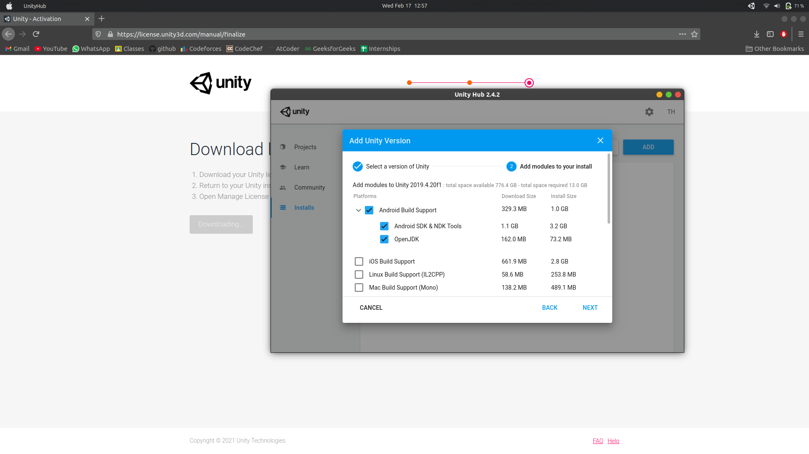

## Installation

#### contact tech team or send a message on the group [do not spam] for issues in installation or if you want someone to guide you while installing.. follow the below steps to get started:

##### note: please try to arrange a [mouse](https://en.wikipedia.org/wiki/Computer_mouse#/media/File:3-Tasten-Maus_Microsoft.jpg), using the laptop trackpad will be hard when using Unity.

1.Go to [https://store.unity.com/download](https://store.unity.com/download) and accept the Terms and conditions by clicking the checkbox and scroll down and press download.

2.The AppImage or EXE file will be downloaded according to your system. Run the file and begin the installation.

3.This window of Unity Hub shoud open if all steps were done correctly:

4.Activate the license, click activate new and follow the instructions shown, upon completion, the following prompt must be seen:

5.Next we have to install the Unity Engine! Go to the Installs tab in Unity Hub and Choose the recommended version for you. 

6.Next install Android Build Support as we will be building a cross-platform game as well [if you do not have access to an android phone, you will still be able to test the game on your PC].

7.After successfully downloading Unity, you should be able to see your Unity version along with the Android Symbol as shown below:

8.Click -> [Download](https://drive.google.com/drive/folders/11BpjfM4v_mwxf6Ecs3Bgrwwq2EjnuOia?usp=sharing) to download from Google Drive and keep this folder on your computer before the workshop, as it is a big folder.
